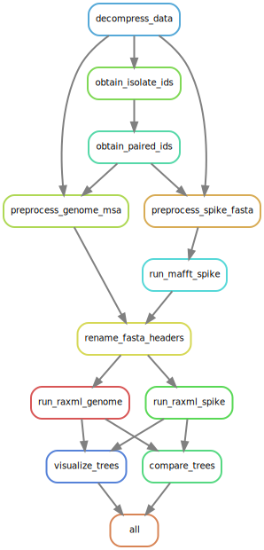

# SARS-CoV-2 Genome and Spike Protein Phylogenetic Comparison Pipeline - Standard Operating Procedure
## Matthew Nguyen
## Background and Rationale
The novel coronavirus disease 2019 (COVID-19) is a newly emerged infectious disease, currently spreading across the world. This disease is caused by a coronavirus named severe acute respiratory syndrome coronavirus 2 (SARS-CoV-2). Undergoing vaccine efforts focus on determining ideal targets for neutralizing antibodies. The SARS-CoV-2 spike glycoprotein plays a key role in the receptor recognition and cell membrane fusion process ([Huang, 2020](https://www.nature.com/articles/s41401-020-0485-4#Sec1)). A large number of glycosylated spike protein covers the surface of the virus and binds to host cell receptor angiotensin-converting enzyme 2, mediating viral cell entry ([Letko, 2020](https://www.nature.com/articles/s41564-020-0688-y). Once the virus is inside the cell, the viral RNA is released, replicated, and released from the host cell. Therefore, the spike protein is an important target for COVID-19 vaccine and drug research.

In order for vaccines and drugs to effectively target a protein, it must be highly conserved despite genetic differences between different isolates. It has been observed in other human coronaviruses that the spike protein is highly conserved, but this must also be the case for SARS-CoV-2 in order to develop an effective vaccine. I hypothesize that even between genetically different genomes found in one country, the spike protein sequence remains highly conserved. In order to study this, I have developed a pipeline that compares the phylogeny of genome sequences against the phylogeny of spike protein sequences from isolates in a country or region. This is an important study to perform for different countries around the world, to ensure the spike protein is highly conserved across _all_ strains around the world, thus supporting that a vaccine targetting the protein would be highly effective. Here, I demonstrate the pipeline on SARS-CoV-2 samples from Vietnam, a smaller sample that would take less time to run. 

The pipeline is implemented using `Snakemake` and consists of multiple steps:

1. Extracting the included spike protein and genome sequences FASTA files
2. Preprocessing the FASTA files in order to filter out sequences not from the country or region of interest
3. Aligning the spike protein sequences using `mafft`
4. Generating phylogenetic trees for the spike protein sequences and genome sequences using `RAxML`
5. Visualizing the phylogenetic trees using `ete3 view`
6. Quantitatively comparing the phylogenetic trees using `ete3 compare`

The directed acyclic graph produced from `snakemake` is shown below.

### Directed Acyclic Graph for Workflow
 

### Dependencies
The following dependencies are required, and defined in the environment YAML file for easy installation via Conda.

* Python (version 3.6.11)
* Snakemake (version 5.28.0)
* MAFFT (version 7.471)
* RAxML-NG (version 1.0.1)
* ETE 3 (version 3.1.2)


## Usage
All datasets are provided in the Github repository, along with the Snakemake workflow and a YAML file for creating a conda environment. 

### Installation
First, clone this repository by running: 

`git clone git@github.com:matnguyen/BIOF501A-snakemake.git`

Then create a Conda environment named `sop` using the included `env.yml` file:

`conda env create -f env.yml`

This will install all the required dependencies. Activate the environment by running:

`conda activate sop`

### Running the workflow
The snakemake pipeline can be run using:

`snakemake --cores 1`

### Steps of the workflow
#### decompress_data
This step decompresses the `msa_1119.tar.xz` and `spikeprot1119.fasta.xz` using the commands `tar -xf msa_1119.tar.xz` and `unxz spikeprot1119.fasta.xz` respectively to produce two uncompressed FASTA files: `msa_1119.fasta` and `spikeprot1119.fasta`

#### obtain_isolate_ids
This step produces two text files containing a list of IDs of Vietnamese SARS-CoV-2 isolates, one from the genome FASTA and one from the spike protein FASTA respectively. This is done using a simple `bash` pipeline comprising of `grep`, `cut`, `sort` and `sed`.

#### obtain_paired_ids
This step produces a single text file containing a list of IDs present in both the genome and spike protein FASTA files, to filter out all IDs that only occur in once, and don't have a paired spike protein and genome sequence. This is done by using the `comm` command in `bash`.

#### preprocess_spike_fasta
This step processes the spike protein FASTA to only include samples present in the paired IDs list. This is a simple `while` loop with `grep`. 

#### preprocess_genome_fasta
The same process outlined for `preprocess_spike_fasta` is done for the genome fasta, producing a processed FASTA file with only samples contained in the paired IDs list.

#### run_mafft_spike
Since the spike protein FASTA is unaligned, this step performs a multiple sequence alignment of the sequences in the FASTA using `mafft`.

#### rename_fasta_headers
This step renames the FASTA headers for both the spike protein and genome FASTA files in order to be compatible with RAxML. This is done using a simple `sed` command.

#### run_raxml_spike:
This step runs `RAxML` to produce a phylogenetic tree for the spike protein sequences from the FASTA file.

#### run_raxml_genome:
Similarly, this step runs `RAxML` to produce a phylogenetic tree for the genome sequences.

#### visualize_tree:
This step produces `PNG` files for visualizing the phylogenetic trees of the spike protein and genome sequences. It takes in the best derived tree from multiple bootstrap runs of `RAxML`. This uses `ete3 view` for visualization.

#### compare_trees
This step uses `ete3 compare` to quantitatively compare the two phylogenetic trees obtained. The reference tree is the genome tree, and the target tree is the spike protein tree. It outputs a text file containing different metrics, which will be explained in the Output section below.

#### all
This step just ensures all the correct output files are generated.


## Input
`config.yaml` is a configuration file passed in to the Snakemake workflow. Here we define a filter country, a prefix for the filenames, an output directory and the number of threads. For this example, our filter country is `Vietnam`, our prefix is `vn`, our output directory is `./outputs` and we define `4` threads. These settings can be changed to fit the user's goal and computational resources. 

The main input for the workflow are two FASTA files: one containing the multiple sequence alignment of 184,718 SARS-CoV-2 genomes from around the world, and one containing 196,674 SARS-CoV-2 spike protein sequences from around the world. These FASTA files will then be preprocessed in order to obtain paired genome and spike protein sequences of isolates from a country or location determined by the configuration file. Both FASTA files are single-line formatted, whereby the first line starting with the `>` character contains the metadata of the isolate, and the second line containing the entire genome or protein sequence. The metadata field contains multiple fields separated by the `|` character: the protein name (if applicable), the virus name/collection location/isolate ID/collection year, the accesion ID, the collection date, and the collection location. There may also be other metadata fields such as the collection institution or the name of the submitter.   

## Output
### Overview
By default, this workflow will create a directory `outputs` to hold the output files (asides from the initial decompressed data). This directory can be change in `config.yaml`. The three main final outputs are a phylogenetic tree for the genome sequences, a phylogenetic tree for the spike protein sequences, and a text file quantitatively comparing the two phylogenetic trees. `outputs/intermediate_files` contains other intermediate files generated by the workflow. An overview all generated files are presented below. `PREFIX` refers to the prefix defined in `config.yaml`, and most output files are paired for the genome sequences and the spike protein sequences, thus `{msa/spikeprot}` indicates a pair of files. 

|                      File Name                      |                                             Description                                            |
|:---------------------------------------------------:|:--------------------------------------------------------------------------------------------------:|
| `{PREFIX}_{msa/spikeprot}_genomid_ids.txt`        | IDs of isolates from country/region of interest                                                    |
| `{PREFIX}_paired_ids.txt`                         | IDs of isolates from country/region of interest that have both a genome and spike protein sequence |
| `{PREFIX}_{msa/spikeprot}_.fasta`                 | Filtered FASTA file containing only isolates from country/region of interest                       |
| `{PREFIX}_spikeprot_aligned.fasta`                 | Aligned FASTA file for spike protein sequences from MAFFT                                          |
| `{PREFIX}_{msa/spikeprot}_fixed.fasta`            | FASTA files with fixed headers for compatibility with RAxML                                        |
| `{PREFIX}_{msa/spikeprot}.raxml.bestTree`          | Best scoring maximum likelihood (ML) tree from RAxML (bifurcating)                                 |
| `{PREFIX}_{msa/spikeprot}.raxml.bestTreeCollapsed` | Multifurcating version of best scoring ML tree from RAxML                                          |
| `{PREFIX}_{msa/spikeprot}.raxml.mlTrees`           | ML trees for each starting tree from RAxML                                                         |
| `{PREFIX}_{msa/spikeprot}.raxml.bestModel`         | Optimized model parameters for the best-scoring ML tree from RAxML                                 |
| `{PREFIX}_{msa/spikeprot}.raxml.support`           | Best-scoring ML tree with bootstrap support values from RAxML                                      |
| `{PREFIX}_{msa/spikeprot}.raxml.rba`               | Compressed multiple sequence alignment in binary format from RAxML                                 |
| `{PREFIX}_{msa/spikeprot}.raxml.log`               | Screen log from RAxML                                                                              |
| `{PREFIX}_{msa/spikeprot}.raxml.bootstraps`        | Trees inferred for each bootstrap replicate in RAxML                                               |
| `{PREFIX}_{msa/spikeprot}.raxml.reduced.phy`       | Reduced alignment from RAxML                                                                       |
| `{PREFIX}_{msa/spikeprot}.raxml.startTree`         | Starting tree(s) using for ML inferecence in RAxML                                                 |
| `{PREFIX}_{msa/spikeprot}_tree.png`                | PNG image of the phylogenetic trees using ETE3                                                     |
| `{PREFIX}_trees_comparison.txt`                    | Quantitative comparisons of the phylogenetic trees using ETE3                                      |

Below, we see the two phylogenetic trees generated by the workflow. 

### Phylogenetic tree obtained from genome sequences


### Phylogenetic tree obtained from spike protein sequences


Qualitatively comparing the two phylogenetic trees, we can see that the two trees are quite different. Most sequences in the spike protein sequences are very genetically similar, with only two small clades that are significantly genetically distinct from the rest. Whereas when we look at the phylogenetic tree generated from genome sequences, we see a lot more distinct clades and a lot of genetic variation. This is an ideal outcome, to see that even genetically different SARS-CoV-2 isolates have genetically similar spike protein sequences, thus meaning the sequence is highly conserved for Vietnamese samples. This means that a vaccine targetting the spike protein may be very effective against SARS-CoV-2 strains found in Vietnam. 

### Quantitative tree comparison
```
 E.size  | nRF     | RF      | maxRF   | src-br+ | ref-br+ | subtre+ | treekoD
 ======+ | ======+ | ======+ | ======+ | ======+ | ======+ | ======+ | ======+
 86      | 0.96    | 160.00  | 166.00  | 0.52    | 0.52    | 1       | NA
 ```
 
Here we see the output of the text file containing the quantitative measures for phylogenetic tree difference between the tree generated by genome sequences and the tree generated by spike protein sequences. We arbitrarily define the target tree as the spike protein tree, and the reference tree as the genome sequence tree. The columns of the text file are:

* `E.size`: the number of isolates in the phylogenetic tree
* `nRF`: normalized Robinson-Foulds distance (RF/maxRF)
* `RF`: Robinson-Foulds symmetric distance
* `maxRF`: maximum Robinson-Foulds value for this comparison
* `src-br+`: frequency of edges in target tree found in the reference
* `ref_br+`: frequency of edges in the reference tree found in target
* `subtre+`: number of subtrees used for the comparison
* `treekoD`: average distance among all possible subtrees in the original target trees to the reference tree

The Robinson-Foulds symmetric distance is a metric for measuring the difference between two trees. In simple terms, it measures the number of clades not shared between the two trees. It is easier to interpret the normalized Robinson-Foulds distance, which represents the percentage of false or missing splits in the target tree compared to the reference tree. Here we see an `nRF` of `0.96`, meaning 96% of the splits in the spike protein tree are false or missing in the genome sequence tree. This means that the two trees are quite dissimilar, and thus we can quantitatively _and_ qualitatively say that the spike protein sequence across SARS-CoV-2 isolates found in Vietnam is highly conserved despite the genetic diversity observed in their genome sequence. 
